<div align="center">
#  ICH — Indian Coffee House
 
**A Full-Stack Mobile Food Ordering Application**
 
[](https://reactnative.dev/)
[](https://nodejs.org/)
[](https://expressjs.com/)
[](https://www.mongodb.com/)
[](https://redux-toolkit.js.org/)
[](https://razorpay.com/)
[](https://jestjs.io/)
 
*An end-to-end food ordering experience — from authentication and food discovery to secure payment and live order tracking.*
 
</div>
---
 
##  Overview
 
**ICH (Indian Coffee House)** is a full-stack mobile food ordering application built with **React Native** on the frontend and a **Node.js + Express.js** REST API on the backend. It simulates a complete restaurant ordering workflow — registration, food browsing, cart management, delivery addresses, checkout, online payments via **Razorpay**, order tracking, and billing.
 
The app uses **MongoDB** for persistence, **Redux Toolkit** for state management, **JWT + bcrypt** for secure authentication, and is backed by an automated **Jest** test suite. It has been built and validated as a **signed Android release APK** on a physical device.
 
---
 
##  Key Features
 
| Module | Highlights |
|---|---|
|  **Authentication** | JWT-based login/register, bcrypt password hashing, persistent session state |
|  **Home & Discovery** | Categories, recommended/popular items, dynamic cart count |
|  **Cart** | Add/remove items, quantity control, auto subtotal + tax + service charge |
|  **Address Book** | Add, view, select, and delete delivery addresses (backend-persisted) |
|  **Checkout & Payments** | Full Razorpay flow — order creation, payment, and server-side verification |
|  **Order Management** | Order creation, history, live status, and tracking |
|  **Bills** | Auto-generated, user-specific billing records |
|  **Profile** | User info and profile state management |
 
---
 
##  Screenshots
 
| Login | Home |
|:---:|:---:|
| 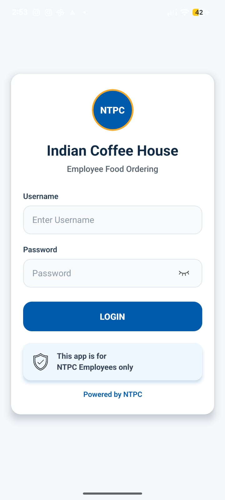 |  |
 
| Menu | Food Details |
|:---:|:---:|
| 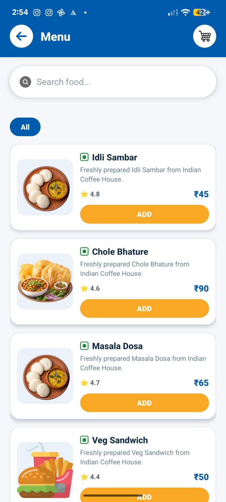 | 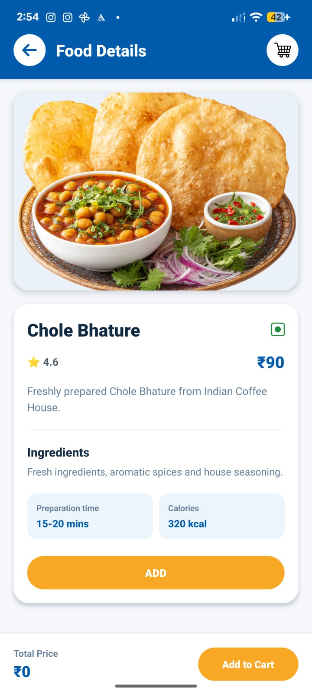 |
 
| Cart | Address Book |
|:---:|:---:|
| 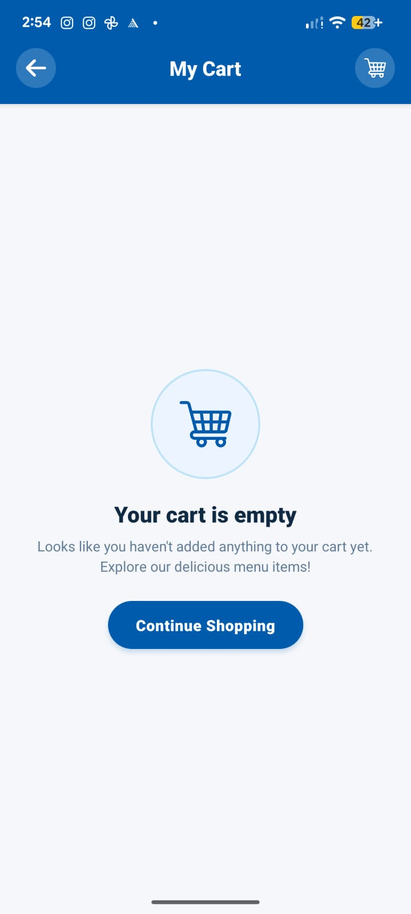 | 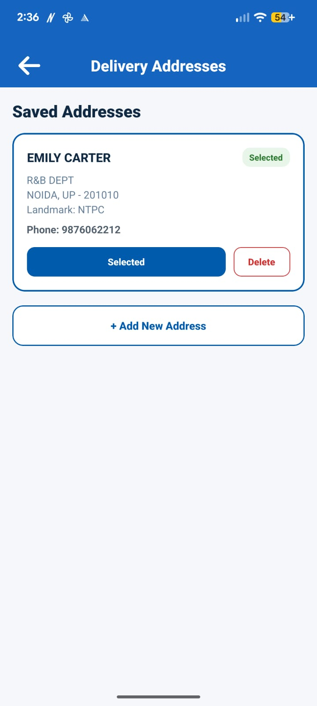 |
 
| Checkout | Razorpay Payment |
|:---:|:---:|
| 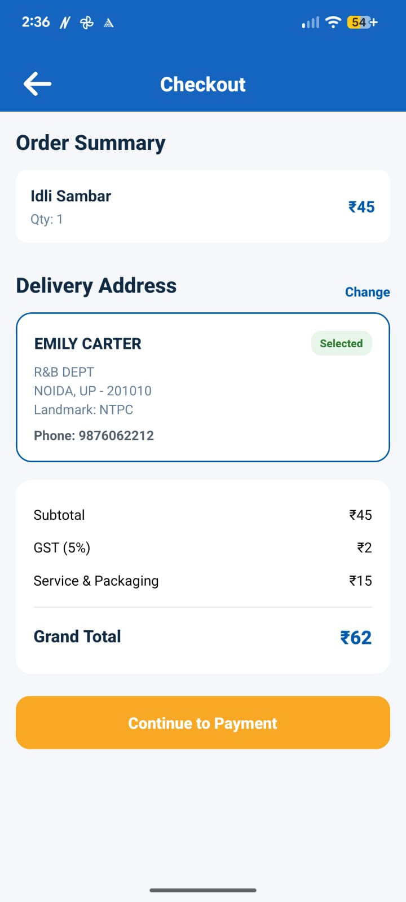 | 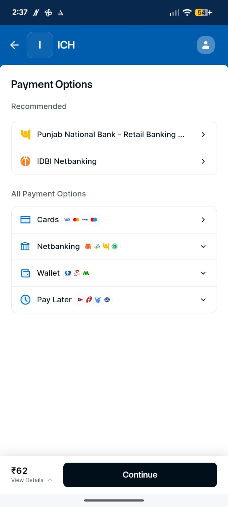 |
 
| Payment Confirmation | Orders |
|:---:|:---:|
| 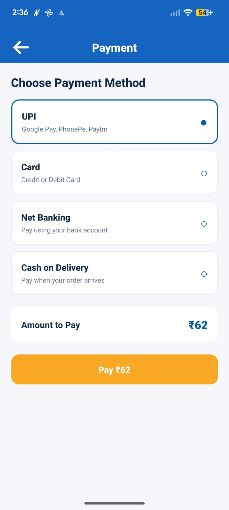 | 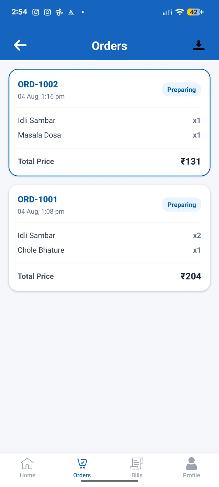 |
 
| Order Details | Order Tracking |
|:---:|:---:|
| 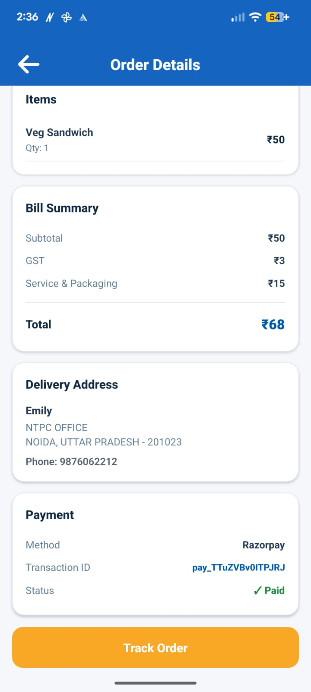 | 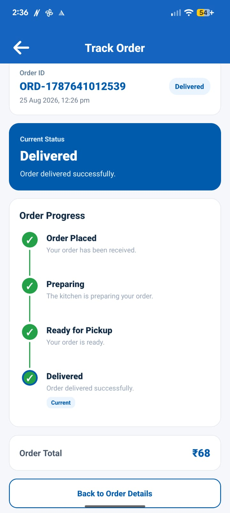 |
 
| Bills | Profile |
|:---:|:---:|
| 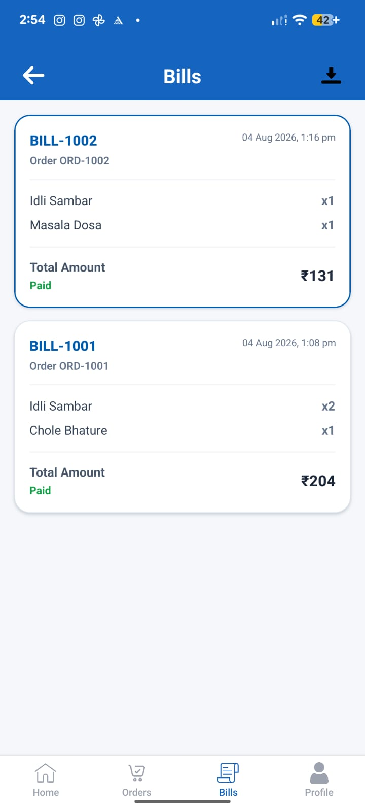 |  |
 
---
 
## System Architecture

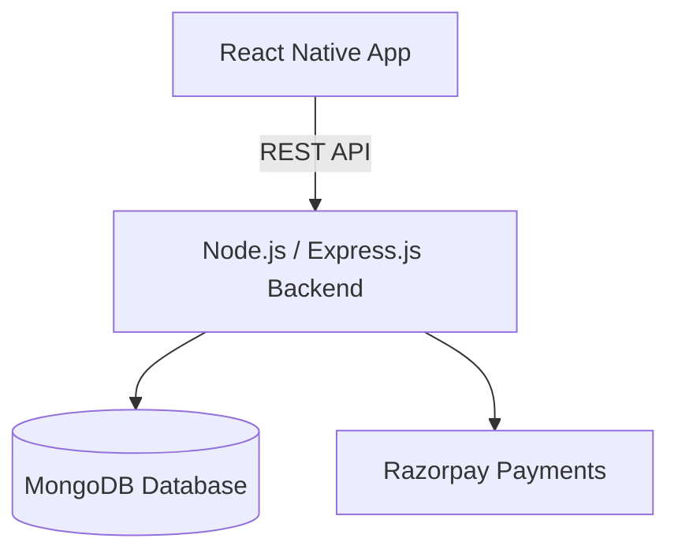

The application follows a client-server architecture where the React Native mobile application communicates with the Node.js/Express.js backend through REST APIs.

The backend handles authentication, users, addresses, orders, and payment operations. MongoDB provides persistent data storage, while Razorpay handles online payment processing.
 
| Layer | Responsibility |
|---|---|
| React Native | Mobile UI & interaction |
| Redux Toolkit | Global application state |
| Express.js | API routing & request handling |
| MongoDB + Mongoose | Persistent storage & schema modeling |
| JWT / bcryptjs | Authentication & password security |
| Razorpay | Online payment processing |
| Jest | Automated testing |
 
---
 
##  Tech Stack
 
**Frontend** — React Native CLI · TypeScript/JavaScript · Redux Toolkit · React Navigation · AsyncStorage
**Backend** — Node.js · Express.js · MongoDB · Mongoose · JWT · bcryptjs · CORS
**Payments** — Razorpay
**Testing** — Jest
**Android** — Android SDK · Gradle · Hermes · Signed Release Build
 
---
 
##  Project Structure
 
```
ICH/
├── android/                  # Native Android project & release build config
├── backend/
│   ├── config/db.js          # MongoDB connection
│   ├── models/                # User, Address, Order schemas
│   ├── routes/                # auth, users, addresses, orders, payments
│   ├── services/userService.js
│   └── server.js
├── src/
│   ├── assets/
│   ├── components/
│   ├── navigation/
│   ├── redux/
│   ├── screens/
│   └── services/
├── screenshots/                # App screenshots used in this README
├── __tests__/                  # Jest test suite
├── __mocks__/asyncStorage.js
└── jest.config.js
```
 
---
 
##  Authentication Flow
 
```
User → Registration/Login Screen → POST /api/auth → Express Backend
     → Password Hash / Compare → MongoDB → JWT Generated → Access Token Returned
```
 
Passwords are hashed with **bcryptjs** before storage; JWTs authenticate subsequent requests. All secrets are loaded via environment variables and never committed to source control.
 
---
 
## Razorpay Payment Flow
 
```
Checkout → Create Razorpay Order → Razorpay Checkout UI → Payment Response
         → Backend Verification → Order Created/Updated → Payment Status Recorded
```
 
---
 
##  Database Design
 
| Model | Key Fields |
|---|---|
| **User** | username, password hash, name, email, gender, age, birth date, phone |
| **Address** | user ID, full name, address, city, state, pincode, landmark, phone |
| **Order** | user ID, items, quantities, subtotal, tax, service charge, total, address, payment method, Razorpay order/payment ID, order & payment status, timestamps |
 
---
 
##  REST API Reference
 
```
Auth        POST   /api/auth/register
            POST   /api/auth/login
 
Users       GET    /api/users/:userId
            PUT    /api/users/:userId
 
Addresses   GET    /api/addresses/user/:userId
            POST   /api/addresses
            DELETE /api/addresses/:addressId
 
Orders      GET    /api/orders/user/:userId
            POST   /api/orders
 
Payments    GET    /api/payment/config
            POST   /api/payment/create-order
            POST   /api/payment/verify
```
 
---
 
##  Testing
 
```bash
npm test -- --runInBand
```
 
** 29/29 tests passing** — covering authentication, cart logic, bills, input validation, and app rendering (with an AsyncStorage mock for local-persistence-dependent tests).
 
---
 
##  Android Release Build
 
```bash
cd android
gradlew.bat assembleRelease
```
 
Output: `android/app/build/outputs/apk/release/app-release.apk`
Signed with a dedicated upload keystore and validated on a physical Android device. Keystore and signing config are git-ignored.
 
---
 
##  Security
 
- Passwords hashed with **bcrypt**
- **JWT**-based stateless authentication
- Environment-based secret management (`.env`, `key.properties`, keystores — all git-ignored)
- No sensitive credentials committed to version control
---
 
##  Getting Started
 
### Prerequisites
Node.js · npm · JDK · Android Studio & SDK · Android device/emulator · MongoDB (local or Atlas) · Razorpay account
 
### Setup
 
```bash
# 1. Clone the repository
git clone https://github.com/Aadit-Sharma/ICH.git
cd ICH
 
# 2. Install frontend dependencies
npm install
 
# 3. Install backend dependencies
cd backend && npm install
```
 
Create `backend/.env`:
 
```env
MONGODB_URI=your_mongodb_connection_string
JWT_SECRET=your_jwt_secret
RAZORPAY_KEY_ID=your_razorpay_key_id
RAZORPAY_KEY_SECRET=your_razorpay_key_secret
PORT=5000
```
 
```bash
# 4. Start the backend
node server.js
 
# 5. Start Metro (from project root)
npx react-native start
 
# 6. Run on Android
npx react-native run-android
```
 
---
 
## Engineering Highlights
 
- **Full-stack ownership** — designed and implemented both the mobile client and the REST backend, not just the UI layer
- **Modular Express API** — clean separation across auth, users, addresses, orders, and payments
- **Secure by design** — bcrypt hashing, JWT auth, and environment-isolated secrets
- **End-to-end payments** — server-verified Razorpay integration from order creation through status tracking
- **Predictable state** — Redux Toolkit slices for cart, orders, bills, and profile shared cleanly across screens
- **Test coverage** — 29 automated Jest tests across core app flows
- **Production-style release** — signed, gradle-built Android APK validated on real hardware
---
 
##  Project Status
 
| Component | Status |
|---|---|
| Authentication & Registration | ✅ Complete |
| Food Browsing & Cart | ✅ Complete |
| Address Management | ✅ Complete |
| Checkout & Razorpay Integration | ✅ Complete |
| Order Management & Tracking | ✅ Complete |
| Bills & Profile | ✅ Complete |
| REST APIs & MongoDB Integration | ✅ Complete |
| Jest Test Suite | ✅ Complete |
| Signed Release APK | ✅ Complete |
 
---
 
##  Future Improvements
 
- Cloud deployment with production HTTPS
- Push notifications & real-time order updates
- Admin dashboard for vendor/inventory management
- CI/CD pipeline with production monitoring & centralized logging
---
 
##  License
 
This project is intended for educational and portfolio purposes.